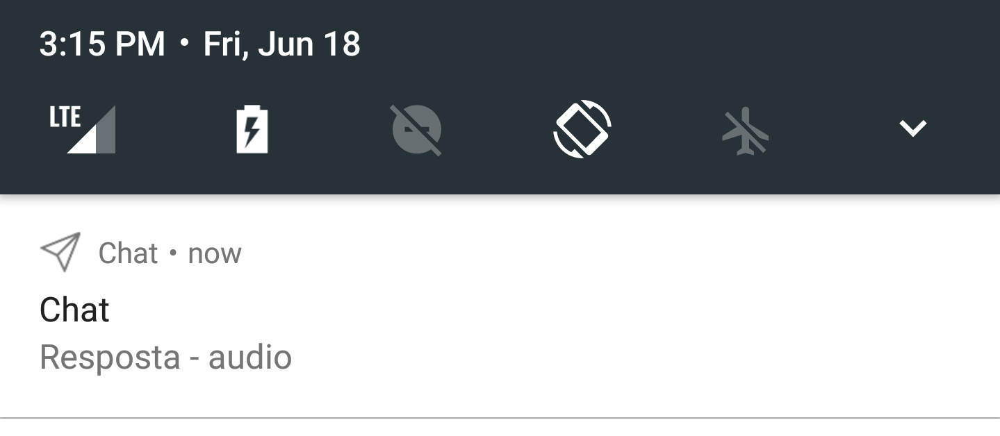

# Chat
### Funções
- [x] Websockets e API
	- [x] Enviando mensagens
	- [x] Recebendo mensagens 
- [x] Gravação, envio e reprodução de áudios
- [x] Captura e envio de imagens
- [x] Envio de arquivos
	- [x] áudio
	- [x] vídeo
	- [x] foto
	- [x] pdf e documentos
- [x] Push Notification 
### Futuras implementações
- [ ] Salvar mensagens no storage do celular para não precisar consultar o websockets quando não tiver internet
- [ ] Visualização de pdfs e outros arquivos

### Capturas de tela - Dark Mode

	
	
	
	
	

### Capturas de tela - Light Mode

	
	
	
	
	
	

